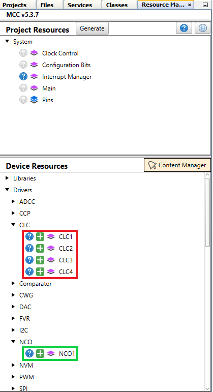
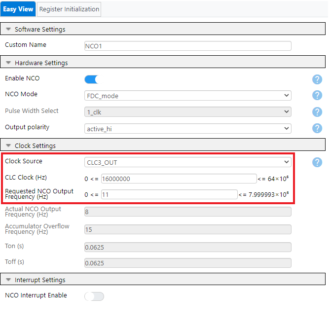

<!-- Please do not change this logo with link -->

# Glitch-Free Design Using the Configurable Logic Cell (CLC) 

This example shows how to configure the Configurable Logic Cell (CLC) Peripheral on the PIC16F18076 to create a clock signal that is glitch-free.

## Related Documentation
- [PIC16F18076 Data Sheet](https://ww1.microchip.com/downloads/aemDocuments/documents/MCU08/ProductDocuments/DataSheets/PIC16F18056-76-28-40-Pin-Microcontroller-Data-Sheet-40002325B.pdf)
- [PIC16F18076 Family Product Page](https://www.microchip.com/wwwproducts/en/PIC16F18076)
- [Glitch-Free Design Using the Configurable Logic Cell (CLC) Application Note](https://www.microchip.com/en-us/application-notes/an3313) <!-- update the an#### with the actual number when the time comes-->

## Software Used

- [MPLAB® X IDE](http://www.microchip.com/mplab/mplab-x-ide) **6.0.0** or newer
- [MPLAB® Xpress IDE](https://www.microchip.com/en-us/development-tools-tools-and-software/mplab-xpress) (alternative to MPLAB® X IDE)
- [MPLAB® XC8](http://www.microchip.com/mplab/compilers) **2.36** or a newer compiler 
- [MPLAB® Code Configurator (MCC)](https://www.microchip.com/en-us/tools-resources/configure/mplab-code-configurator) **5.1.9** or newer 
- [MPLAB® Melody Library](https://www.microchip.com/en-us/tools-resources/configure/mplab-code-configurator) **2.2.16** or newer 
- [Microchip PIC16F1xxxx Series Device Support pack](https://packs.download.microchip.com/) **1.14.187** or newer Device Pack

## Hardware Used
- PIC16F18076 Curiosity Nano [(DM182029)](https://www.microchip.com/Developmenttools/ProductDetails/DM182029) <!-- update this line to have the correct DM number and the correct link to that -->
<!-- Should I include the Saleae since it can be used to verify if the example works? -->
<!-- Should I include the scope since it can be used to verify if the example works? -->

## Setup
The hardware for this code example is just the PIC16F18076 Curiosity Nano Board since it has the NCO and CLC modules that are required. Figure 1 shows how to create the Glitch-Free signal by using CLC1, CLC2, and CLC3.  CLC4 will be passing through the system clock.  Most of the setup will be done through the MPLABX and Melody interfaces. 

*Figure 1 - Creating Glitch-Free Clock Signal*

Each of the following sections show how to configure each component of the example to be able to create the example yourself from scratch.

### Setup - MPLABX and Melody Environment
- Step 1: Open up MPLABX v6.0.0 or newer
- Step 2: Create a new project with the following information (bold is the step on the left side of the new project wizard)
    - **Choose Project**: 
        - Select the 'Microchip Embedded' category 
        - Select the 'Standalone Project' project
        - Click 'Next'
    - **Select Device**: 
        - Select 'All Families' for family
        - Select 'PIC16F18076' for device
        - Select the Curiosity Nano board connected to your computer for tool
            - Note: 'No Tool' can be selected too, just later on you won't be able to program a device until on is connected
        - Click 'Next'
    - **Select Header**: SKIP
    - **Select Plugin Board**:SKIP
    - **Select Compiler**:
        - Select the XC8 v2.36 version for the compiler 
        - Click 'Next'
    - **Selct Project Name and Folder**:
        - Enter the name of your project
        - Make sure that the Project Location and Folder are what you want
        - Make sure that 'Set as main project' is selected
        - Click 'Finish'
- Step 3: Open up 'MCC' from the toolbar at the top (then go to Step 4)
    - If you don't see 'MCC' in your toolbar, click on the link above for 'MPLAB Code Configurator' and follow the 'Easy Installation' video at the link. Then open up MCC.
- Step 4: Click 'Select MCC Melody' and then 'Finish' from the MCC Content Manager Wizard (red box in Figure 2 and Figure 3)

*Figure 2 - MCC Content Manager Wizard*

*Figure 3 - MCC Content Manager Wizard (Finish)*

- Step 5: Select all four CLC modules and the NCO Module from the Device Resources list on the left (see red and green boxes in Figure 4, click the 'plus' mark) and make sure they show up within the Project Resouces list (blue box in Figure 5)

*Figure 4 - Device Resources for CLC and NCO*

*Figure 5 - Project Resources for CLC and NCO*

### Setup - CLC 1
Click on CLC1 in the Project Resources list to open the configuration menu. Within the menu, modify the following settings:
- **Logic Cell Mode bits:** Select 'OR-XOR' from the dropdown menu
- **Second Input:** Select 'Fosc' from the dropdown menu
- **Third Input:** Select 'CLC2_OUT' from the dropdown menu
- **Second OR Gate:** Select the second input to be 'Fosc'
- **Fourth OR Gate:** Select the third input to be 'CLC2_OUT'

These settings set CLC1 as the XOR of the Clock signal and the output of CLC2 (red boxes in Figure 6).

*Figure 6 - Configuration of CLC1*

### Setup - CLC 2
Click on CLC2 in the Project Resources list to open the configuration menu. Within the menu, modify the following settings: 
- **Logic Cell Mode bits:** Select '1-input D flip-flop with S and R' from the dropdown menu
- **Enable CLC Interrupt:** Select 'Enable CLC Interrupt'
- **Enable Falling Interrupt:** Select 'Enable Falling Interrupt'
- **First Input:** Select 'CLCIN1' from the dropdown menu
- **Second Input:** Select 'Fosc' from the dropdown menu
- **Third Input:** Select 'CLC1_OUT' from the dropdown menu
- **Fourth Input:** Select 'LFINTOSC' from the dropdown menu
- **First OR Gate:** Select the third input to be 'CLC1_OUT', this ultimately becomes the clock line for the D flip-flop
- **Second OR Gate:** Select the first input to be 'CLCIN1', this ultimately becomes the data line (D) for the D flip-flop

These settings set CLC2 as the D flip-flop of the asynchronous pulse and make it clocked by the output of CLC1 (red boxes in Figure 7).

*Figure 7 -  Configuration of CLC2*

### Setup - CLC 3
Click on CLC3 in the Project Resources list to open the configuration menu. Within the menu, modify the following settings 
- **Logic Cell Mode bits:** Select '4-input AND' from the dropdown menu
- **First Input:** Select 'CLCIN2' from the dropdown menu
- **Second Input:** Select 'Fosc' from the dropdown menu
- **Third Input:** Select 'CLC2_OUT' from the dropdown menu
- **Fourth Input:** Select 'TX1' from the dropdown menu
- **First OR Gate:** Select the NOT symbol on the right side of the gate
- **Second OR Gate:** Select the second input to be 'Fosc'
- **Third OR Gate:** Select the third input to be 'CLC2_OUT'
- **Fourth OR Gate:** Select the NOT symbol on the right side of the gate

These settings set CLC3 as the AND of the asynchronous pulse and the output of CLC2 (red boxes in Figure 8).

*Figure 8 -  Configuration of CLC3*

### Setup - CLC 4
Click on CLC4 in the Project Resources list to open the configuration menu. Within the menu, modify the following settings 
- **Logic Cell Mode bits:** Select '4-input AND' from the dropdown menu
- **First Input:** Select 'CLCIN3' from the dropdown menu
- **Second Input:** Select 'Fosc' from the dropdown menu
- **Third Input:** Select 'CLC2_OUT' from the dropdown menu
- **First OR Gate:** Select the NOT symbol on the right side of the gate
- **Second OR Gate:** Select the second input to be 'Fosc'
- **Third OR Gate:** Select the NOT symbol on the right side of the gate
- **Fourth OR Gate:** Select the NOT symbol on the right side of the gate

These settings set CLC4 as the pass through of the system clock (red boxes in Figure 9).

*Figure 9 -  Configuration of CLC4*

### Setup - Clock Control, Configuration bits, and Interrupt Manager
Click on Clock Control in the Project Resources list to open the configuraton menu. Within the menu, modify the following settings:
- **Current Oscillator Source Select:** Select 'HFINTOSC_32MHz' from the dropdown menu
- **HF Internal Clock:** Select '16_MHz' from the dropdown menu
- **System Clock (Hz):** Verify that the Hz value updated to '16000000'

These clock settings are also shown within the red boxes in Figure 10.

*Figure 10 -  Clock Control Configuration*

Click on Configuration Bits in the Project Resources list to open the configuration menu.  Within the menu, modify only the following settings (NOTE: If any other settings are modified the example may not behave correctly): 
- **External Oscillator Selection bits:** Select 'Oscillator not enabled' from the dropdown menu
- **Reset Oscillator Selection bits:** Select 'HFINTOSC (32 MHz)' from the dropdown menu

These configuration bit settings are also shown within the red boxes in Figure 11.

*Figure 11 -  Configuration Bit Settings*

Click on Interrupt Manager in the Project Resouces list to open the configuration menu.  Verify that the menu looks like Figure 12. If it does not, check the 'Enable' box for CLC2 (so that it looks like Figure 12).

*Figure 12 -  Interrupt Manager Settings*

### Setup - NCO
Click on NCO1 from the Project Resource list to open the configuration menu. Within the menu, modify the following settings in the order they are listed:
1. **CLC Clock (Hz):** Change the value to be 16MHz (16000000 Hz)
2. **Requested NCO Output Frequency:** Change the value to 7999993Hz (max possible for 16MHz in above setting)
3. **Clock Source:** Select 'CLC3_OUT' from the dropdown menu

These NCO settings are also shown within the red boxes in Figure 13.

*Figure 13 -  Configuration of NCO1*

### Setup - Pin Configurations

Click on Pins from the Project Resources list to open the configuration menu and pins grid view.  Within the pins grid view, modify only the following pins:

- **CLC4 -- CLC4 -- Output** Click PORTB pin 1, wait for the green box with lock inside to appear
- **CLC4 -- CLCIN0 -- Input** Click PORTC pin 7, wait for the green box with lock to disappear
- **CLC4 -- CLCIN3 -- Input** Click PORTB pin 7, wait for pin to be unlocked
- **CLC3 -- CLC3 -- Output** Click PORTB pin 3, wait for pin to be locked
- **CLC3 -- CLCIN2 -- Input** Click PORTB pin 4, wait for pin to be locked
- **CLC2 -- CLC2 -- Output** Click PORTC pin 3, wait for pin to be locked
- **CLC1 -- CLC1 -- Output** Click PORTA pin 2, wait for pin to be locked
- **CLC1 -- CLCIN0 -- Input** Click PORTC pin 7, wait for pin to be locked
- **NCO1 -- NCO1 -- Output** Click PORTA pin 5, wait for pin to be locked

Figure 14 shows the final outcome from the above steps within the red boxes.

*Figure 14 -  Pins Grid View*

Within the configuration menu, uncheck the 'Analog' box for all pins. 

Figure 15 shows the configuration menu with no Analog checkboxes checked (see red boxes in image).

*Figure 15 -  Pin Configuration Menu*

### Setup - Melody Notifications
When setting up the above components, Melody may send out differing type of notifications.  These notifications are consolidated into a list that can be found by clicking on the tab called 'Notifications[MCC]' (towards the bottom).  Figure 16 shows two types of notifications that may be listed; 'HINT' and 'WARNING'. 

*Figure 16 -  Melody Notification List*

For the CLC1, CLC2, CLC3, and CLC4 lines (top two lines and lines 5 and 8), these are all 'HINT' notifications that are checking to make sure that the other CLC modules are configured.  Since all four modules of the CLC are being used, then they should already be configured (see above CLC configuration sections)

By following matching the 'Interrupt Manager' menu with Figure 12, the necessary code will be generated.  Therefore, for the two lines that say 'Interrupt Manager' as the source, can be ignored.

For the NCO1 line, there is a 'WARNING' notification.  This notification will be address in the section below titled 'Setup - Software' which will show how to set 'CLC3_OUT' as the Clock Source (see Figure X).

### Setup - Software

Click Generate within the Project Resources Menu to generate the code (Figure 17).

*Figure 17 -  Generate Code*

There may be a popup once you click Generate that looks like Figure 18, click Yes to continue.  The next step will solve the issue the popup is warning about.

*Figure 18 -  Melody Code Warning*

#### Set CLC3_OUT as a Clock Source
Next, the CLC3_OUT signal needs to be configured as a clock source (since it had the 'WARNING' notification).  This configuration will be done by setting the output bit for the CLC3 module.  To do this, navigate to the clc3.c file in Figure 19.

*Figure 19 -  Navigate to CLC3.c*

Then open up the file.  On line 62, update the value from 0x0 to 0x4 as shown in Figure 20.

*Figure 20 -  Update CLCDATA Register*

#### Remaining Application Code

Finally open up the main.c program from the projects tab (see Figure 19 - line call 'main.c'). Insert the following code inside the 'int main(void)' loop after the 'SYSTEM_Initialize();' line but above the 'while(1)' loop:
    
    NCO1CONbits.EN = 0;  //disable NCO module
        
    NCO1INCU = 0x00;
    NCO1INCH = 0x00;
    NCO1INCL = 0x01;     //set increment to 0x000001, or 1
    
Insert the following code inside the  'while(1)' loop:

    //wait initialize
    NCO1ACCL = 0x00; 
    NCO1ACCH = 0x00; 
    NCO1ACCU = 0x00;  //clear accumulator

    NCO1CONbits.EN = 1; //enable NCO module
    PIR2bits.CLC2IF = 0; //clear CLC2IF interrupt flag
    
    //wait for pulse
    while(!PIR2bits.CLC2IF); //wait until interrupt flag is set

        //save accumulator value
        int8_t result2 = NCO1ACCU; 
        int8_t result1 = NCO1ACCH;
        int8_t result0 = NCO1ACCL;

        //process accumulator values to make a 20-bit value
        int24_t measurement = ((int24_t)result2 << 16); 
        measurement = measurement + ((int16_t)result1 << 8);
        measurement = measurement + result0;

    NCO1CONbits.EN = 0; //disable NCO module

If inserting the above code is confusing, look through the files included in this code example to see exactly where the lines of code should go.

Then program the device by clicking on the "Make and Program Device Main Project" from the taskbar at the top (Figure 21).

*Figure 21 -  Make and Program Device Main Project Button*

Wait for the Output tab to show 'Programming Complete' (Figure 22) then proceed to Operation.

*Figure 22 -  Programming Complete*

## Operation

This example requires an external asynchronous signal source in order for it to behave correctly.  This can be acheived by using a function generator, another microcontroller, or any other method of producing a high or low signal.

Before starting the asynchronous signal, ensure that there is a common ground between the devices, and that the input for the CLC is attached to the RA1 pin.

The following image shows what the various logic should do during a single asynchronous pulse.

*Figure 23 -  Glitch-Free Clock Output*

<!-- NOTE: The Asynchronous signal used for this example was another cnano board.  It followed the same timing configuration as the above cnano but for the pin output it only had RA3 toggling on and off.  In between the high and low signal, there was 1us delay. Between the low and high signal, there was a 50us delay. Then the RA3 pin (of the asynchronous signal) was connected to the RA1 pin (of the CLC modules). -->

## Summary

This example has demonstrated how to create a glitch-free design using the CLC peripherals on the PIC16F18076 device.
